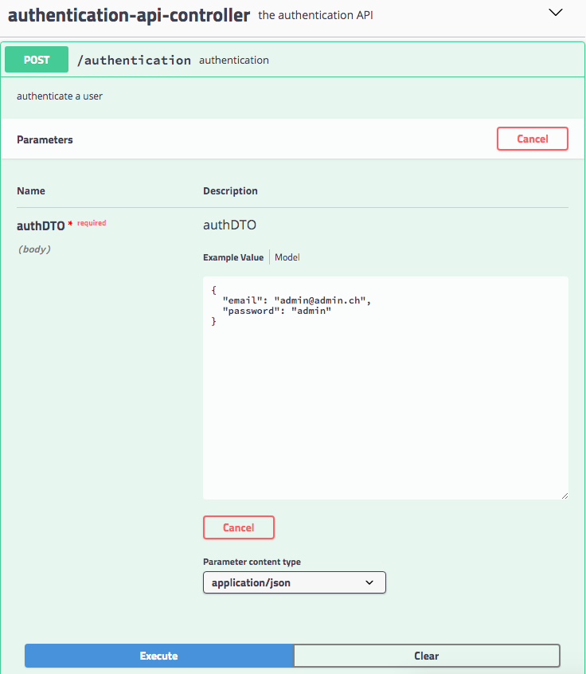

# Teaching-HEIGVD-AMT-2019-Project-Two

> François Burgener, Tiago Povoa Q.

## In short

Implementation of 2 Restful API using Spring Boot, Swagger, JWT and Cucumber

## Introduction

*If you need to start the project in a dev environment, go to the appropriate section at the end of this document*

### Quick Start

To run this project, first go to `topology/prod`. 

You'll have to add env variables. For example by adding `topology/prod/.env` file like the following:

```
ROOT_PASSWORD=admin
MYSQL_DATABASE_AUTH=authentication_api
MYSQL_DATABASE_TRAVEL=travel_api

DB_PORT=3306
TOKEN_SECRET=secret

DB_USERNAME=root
```

Then start it with `docker-compose up`. It will run a few containers:

* Traefik that we use as a dynamic reverse proxy. Don't mind the funny gophers in here.
* Two Spring APIs: Auth and Travel
* Two MySQL Databases
* A phpmyadmin container so you can inspect data

#### Hosts

We all enjoy a pretty url instead of typing the docker host IP. So we edited the host file.

Mac/Linux: `/etc/hosts`

```
127.0.0.1 www.todotravel.ch
```

Windows: `windows\system32\drivers\etc\hosts`

```
192.168.99.100 www.todotravel.ch
```

#### Have a look to the Swagger specs

If you need the specification of both APIs, you can visit the following:

* Travel API: http://www.todotravel.ch/api-travel
* Auth API: http://www.todotravel.ch/api-auth

In case you want to check the swagger spec files, you can see them in here:

`microservices/travel/spring-server/src/main/resources/api-spec.yaml`

`microservices/authentication/spring-server/src/main/resources/api-spec.yaml`

#### Demo

Here is a usage example:



We authentify by using a authDTO payload to pass the email and password,

```json
{
  "email": "admin@admin.ch",
  "password": "admin"
}
```

and we retrieve the JWT token in the response body.

## Business domain

### Database

For our business domain, we choose the same as the previous project. 

In our Travel API, users make trips to countries with some main reason. You can see our database model in the following picture:


In the second API who manages authentication, we have an extanded full user table. In the following, we store the password hashes, as well as the role of the user and her personal information. 


### Implementation

Let's dive into the implementation


* Api
  * Endpoints: Controllers that define ours HTTP Routes.
  * Interceptor: We use an interceptor to intercept an incoming HTTP Request, check the Authorization header for a correct token.
  * Service: A few utils that allow us to create JWT tokens as well as verifying it. Authenticate service is about hashing the password (using BCrypt). 
* Entities : Here we have our JPA Entities. Simple POJOs that are managed by the Entity Manager
* Repositories: The repositories, used as an abstraction layer over the DB. 

## Testing strategy

### Cucumber tests

TODO Explain the tools and the value of the tests

### Performance tests with JMeter

TODO

* number
* Graphs
* Explanations

## Known bugs and limitations

todo

## Dev environment

First, start the dev topology in `topology/dev`.

You have to add a dot env file in here `topology/dev/.env`

```
ROOT_PASSWORD=admin
MYSQL_DATABASE_AUTH=authentication_api
MYSQL_DATABASE_TRAVEL=travel_api
```

It's only purpose is passing variables to the databases.

### Open the projects

You can open both API projects with IntelliJ

Travel: `microservices/travel/full-project/.idea`

Auth: `microservices/authentication/full-project/.idea`

Since our APIs need to connect to the databases, we also need to pass it some... you guessed it: environment variables. 

`microservices/authentication/spring-server/src/main/resources `

```
DB_HOST={YOUR DOCKER HOST}
DB_PORT=3306
TOKEN_SECRET=secret

DB_USERNAME=root
DB_PASSWORD=admin
```

`microservices/travel/spring-server/src/main/resources `

```
DB_HOST=localhost
DB_PORT=3307
TOKEN_SECRET=secret

DB_USERNAME=root
DB_PASSWORD=admin
```

> Note: if you decide to change the secret, keep in mind that you should change both with the same.

# TODO

- [ ] Hibernate: none en prod. Ajouter une env var
- [ ] Test JMeter

