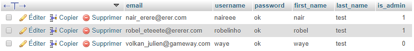
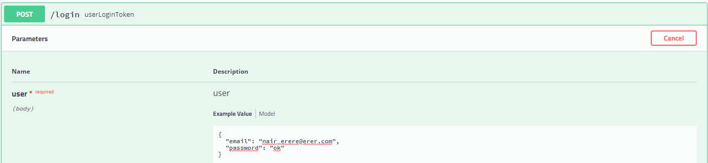
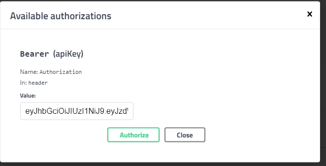
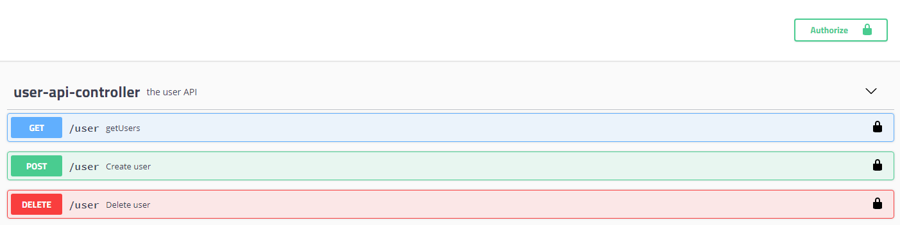

# Teaching-HEIGVD-AMT-2019-Project-Two

Authors : Robel Teklehaimanot & Nair Alic

## Objectives

Here we explain how to use the api.

### Login - Authentication 

In order to have a token you have to go to : `192.168.99.100/userapi`

Then in the /login

Put an existing username and password (up) :

Then you should get a token, click on authorize and paste your token to login :

After that you should be able to do all the other GET/POST/UPDATE/DELETE (only ADMIN for managing other users)

In the other api where you manage the Videogames, the operations are the same as here. First login, then use GET/POST/DELETE.

